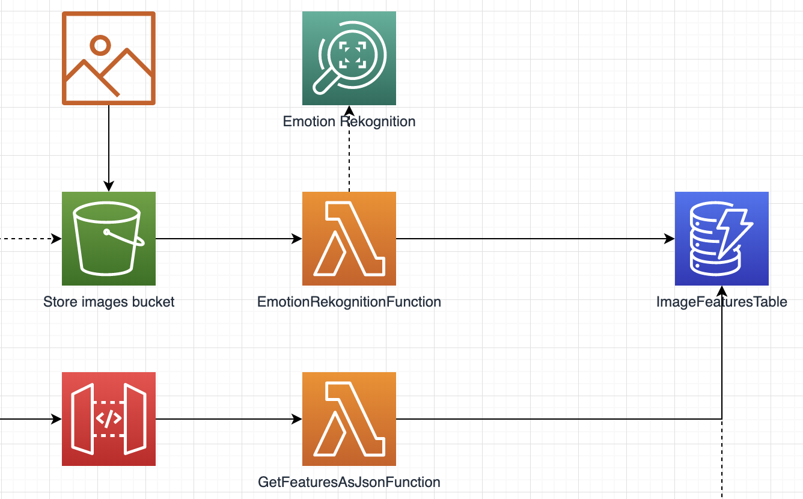

#  image-emotion-rekognizer

This lambda is finds the emotions on a picture and saves the result in dynamodb.  
It is triggered by an upload of a picture to an S3 bucket.  
It recognizes the emotions on the picture and stores the result in dynamodb.  
You can retrieve these emotions via the API.

## Instructions

* deploy for the first time: `sam deploy --guided`
* deploy from the second time: `./deploy.sh`
* destroy: `aws cloudformation delete-stack --stack-name image-emotion-rekognizer --region eu-west-1`
* upload image to s3: `aws s3api put-object --bucket people-faces-images-bucket --key picture.jpeg --body picture.jpeg --region eu-west-1`
